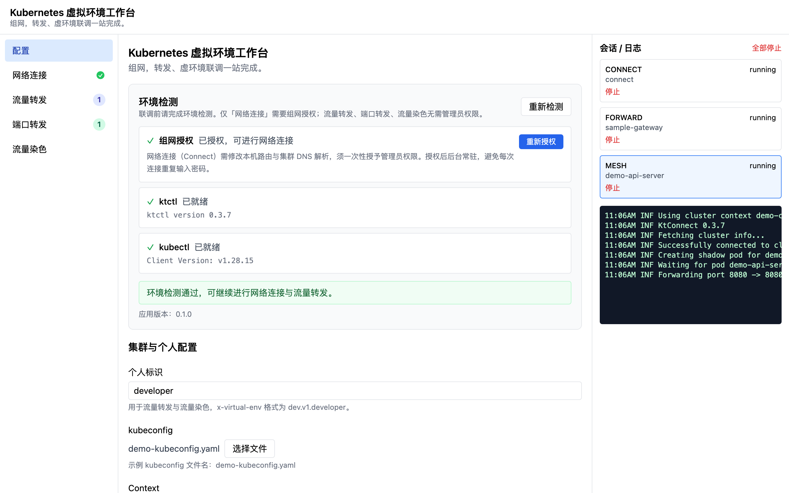
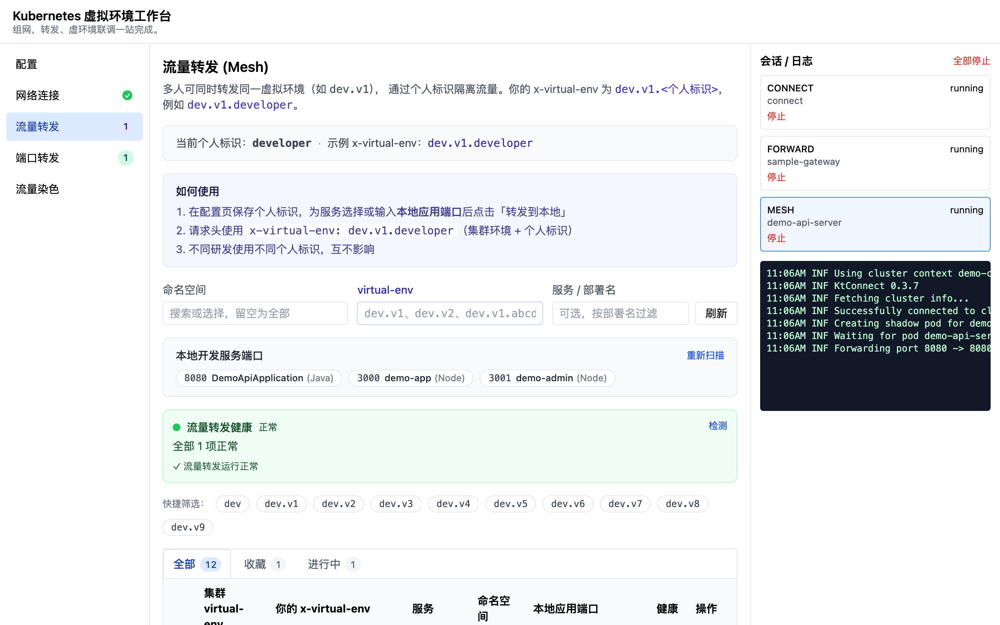
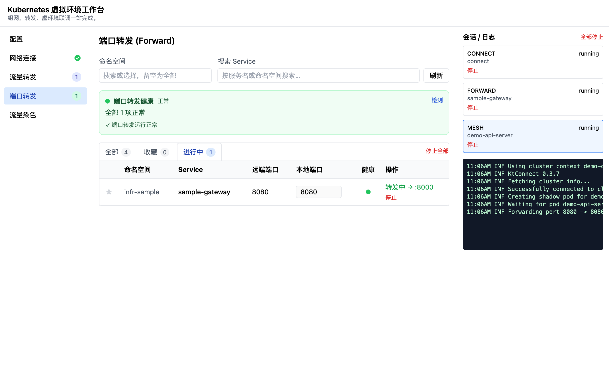
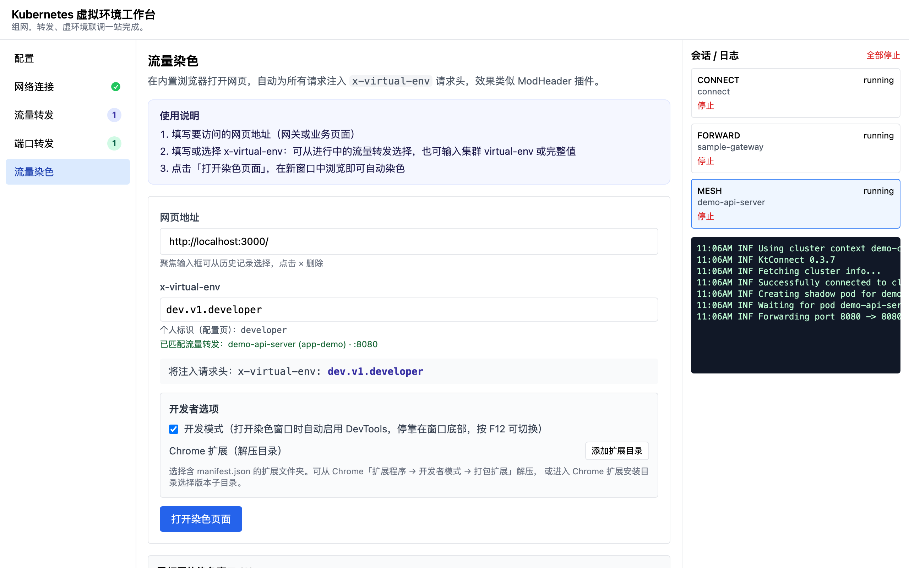
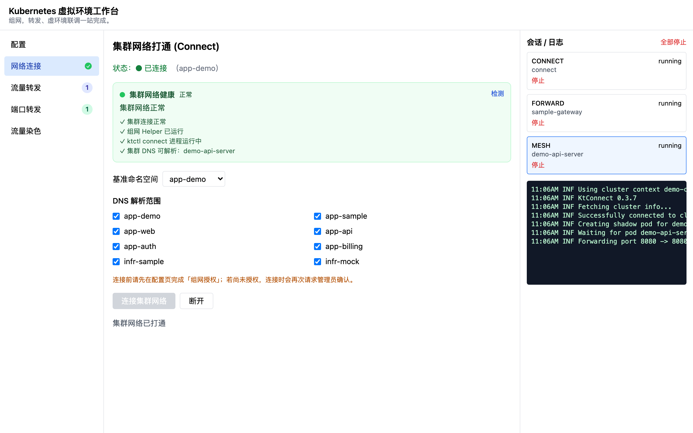
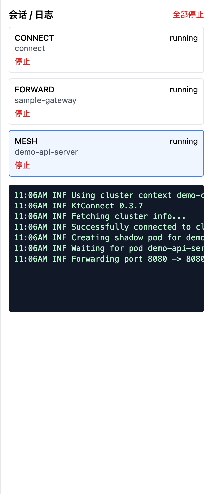

<div align="center">

# Kubernetes 虚拟环境工作台

**kt-virtual-env**

组网 · 转发 · 虚环境联调一站完成

[]()
[](https://github.com/alibaba/kt-connect)
[](https://www.electronjs.org/)
[](https://nodejs.org/)

[**设计规格**](./docs/superpowers/specs/2026-06-06-kt-virtual-env-desktop-design.md) &nbsp; |
&nbsp; [**实现计划**](./docs/superpowers/plans/2026-06-06-kt-virtual-env-desktop.md) &nbsp; |
&nbsp; [**kt-connect 文档**](https://alibaba.github.io/kt-connect/) &nbsp; |
&nbsp; [**截图说明**](./docs/images/README.md)

</div>

---

## kt-virtual-env 是什么？

**Kubernetes 虚拟环境工作台**（kt-virtual-env）是一款跨平台桌面应用，面向 **Kubernetes + Istio 多套 virtual-env** 的本地联调场景。它将 [kt-connect](https://github.com/alibaba/kt-connect) 的 **Connect / Forward / Mesh** 能力图形化，并集成流量染色、健康检测与会话管理，让开发者无需记忆复杂命令行参数。

如果你熟悉 `ktctl`，可以把它理解为「带 UI 的 ktctl 工作台」；如果不熟悉，按下方 [**快速开始**](#快速开始) 四步即可完成首次联调。

### 核心使用场景

在团队通过 Istio `virtual-env` 隔离多套测试环境时，开发者常需要在本地进程与集群流量之间快速切换。kt-virtual-env 覆盖完整联调链路：

- **组网**：一次授权打通本机与集群 DNS（`ktctl connect`）
- **引流**：将指定 virtual-env 流量打到本机 Java / Node / .NET 服务（`ktctl mesh`）
- **穿透**：将集群 Service 端口映射到本机（`ktctl forward`）
- **染色**：浏览器访问网关时自动注入 `x-virtual-env` 请求头



## Summary

- [**快速开始**](#快速开始)
- [**使用场景**](#使用场景)
- [**核心优势**](#核心优势)
- [**功能展示**](#功能展示)
- [**架构概览**](#架构概览)
- [**开发与构建**](#开发与构建)
- [**常见问题**](#常见问题)
- [**相关文档**](#相关文档)

---

## 快速开始

### 环境要求

| 项目 | 要求 |
|------|------|
| 操作系统 | macOS（Apple Silicon / Intel）、Windows 10+ |
| 集群访问 | 有效的 kubeconfig，可访问目标 Kubernetes 集群 |
| 开发构建 | Node.js ≥ 20、pnpm 9 |
| 网络连接 | 首次 Connect 需管理员授权 |

### 从源码启动

```bash
# 克隆仓库后进入目录
pnpm install

# 首次：下载内嵌 ktctl / kubectl，并编译特权 Helper
pnpm fetch-binaries
pnpm build:helper

# 启动桌面应用（开发模式）
pnpm dev
```

### 四步完成首次联调

**① 配置** — 打开 **配置** 页，选择 kubeconfig、集群 Context，填写 **个人标识**（如 `developer`），完成环境检测与 Helper 授权。

**② 连接** — 进入 **网络连接**，选择 DNS 解析范围（默认 `app-*` / `infr-*` 命名空间），建立集群隧道。

**③ 转发** — 在本机启动目标服务后，进入 **流量转发**，选择 virtual-env 与工作负载，指定 **本地应用端口**，点击「转发到本地」。

**④ 验证** — 请求携带请求头 `x-virtual-env: dev.v1.<个人标识>`，或使用 **流量染色** 在浏览器中自动注入该头访问网关。

```http
x-virtual-env: dev.v1.developer
```

### 打包安装包

```bash
pnpm build
pnpm --filter @kt-virtual-env/desktop pack:mac   # macOS .dmg
pnpm --filter @kt-virtual-env/desktop pack:win   # Windows 安装包
```

安装包输出目录：`dist/packages/`（仓库根目录）

| 平台 | 文件名示例 |
|------|------------|
| macOS (Apple Silicon) | `kt-virtual-env-0.1.0-mac-arm64.dmg` |
| macOS (Intel) | `kt-virtual-env-0.1.0-mac-x64.dmg` |
| Windows | `kt-virtual-env-0.1.0-win-x64.exe` |

应用内显示名称仍为「Kubernetes 虚拟环境工作台」；磁盘上的 `.app` / 可执行文件名为 `kt-virtual-env`。

### GitHub Release 自动发布

推送版本 tag 后，GitHub Actions 会自动构建并发布安装包：

```bash
git tag v0.1.0
git push origin v0.1.0
```

工作流：`.github/workflows/release.yml`

| 产物 | 平台 |
|------|------|
| `kt-virtual-env-{version}-mac-arm64.dmg` | macOS Apple Silicon |
| `kt-virtual-env-{version}-mac-x64.dmg` | macOS Intel |
| `kt-virtual-env-{version}-win-x64.exe` | Windows x64 |

Release 页同时附带 `SHA256SUMS.txt` 校验文件。也可在 Actions 页手动触发 **Release** 工作流（`workflow_dispatch`）。

---

## 使用场景

### 本地服务接管集群流量（Mesh）

将某一 `virtual-env` 下指定 Deployment 的流量路由到 **本机已在监听的端口**。应用自动扫描本机 Java / Node / .NET 监听端口，支持手动输入；多人通过不同个人标识隔离流量。



---

### 访问集群 Service（Forward）

将集群 Service 的远端端口映射到本机 **空闲端口**，适合直接调试集群内服务、查看 Swagger 文档等。与 Mesh 的区别：Forward 占用新端口；Mesh 转发到已有本地进程。



---

### 浏览器流量染色（Stain）

在内置浏览器打开业务页面或 API 网关，自动为所有请求附加 `x-virtual-env`。支持网页地址历史、从进行中 Mesh 选择环境、开发模式 DevTools、加载解压后的 Chrome 扩展。



---

### 集群网络打通（Connect）

建立本地到 Kubernetes 的网络隧道，解析 `*.svc.cluster.local` 等集群 DNS。通过 Go 特权 Helper **一次授权**，避免每次 `ktctl connect` 重复输入密码。



---

## 核心优势

- **开箱即用**

  内嵌 ktctl `0.3.7` 与 kubectl，无需单独安装配置 CLI，不依赖系统 PATH。打开应用即可开始联调。

- **降低心智负担**

  自动发现带 `virtual-env` 标签的 Deployment，生成 Mesh 命令参数；服务列表支持命名空间过滤、收藏与「进行中」页签。

- **一次授权**

  Connect 走特权 Helper 提权；Forward、Mesh、流量染色在 Helper 就绪后无需反复管理员确认。

- **可观测**

  统一会话面板、实时日志、健康检测（ktctl 进程、本地端口、集群 API、DNS 解析），导航栏展示连接状态与进行中数量。

- **多人协作友好**

  通过 `x-virtual-env: {集群环境}.{个人标识}` 隔离流量，同一 virtual-env 下多名研发可同时联调互不影响。

---

## 功能展示

### 配置与环境检测

kubeconfig / Context 选择、个人标识、Helper 状态与环境自检。


### 流量转发

virtual-env 筛选、本地开发端口扫描、本地应用端口选择、Mesh 会话健康状态。


### 端口转发

Service 搜索、本地端口建议、收藏与批量停止。


### 流量染色

URL 历史、x-virtual-env 合并输入（选择或手动）、开发者选项。


### 会话与日志

右侧面板集中展示 Connect / Forward / Mesh 会话，支持停止与日志查看。



---

## 架构概览

```
┌──────────────────────────────────────────────────────────┐
│  Electron 应用（Kubernetes 虚拟环境工作台）                 │
│  ├─ Renderer   React UI（配置 / 连接 / 转发 / 染色）        │
│  ├─ Main       进程编排 · IPC · 配置 · 健康检测             │
│  └─ 内嵌       kubectl（发现）+ ktctl（forward / mesh）     │
│                    │ connect 经 IPC                         │
└────────────────────┼─────────────────────────────────────┘
                     ▼
┌──────────────────────────────────────────────────────────┐
│  Privileged Helper（Go）                                  │
│  一次授权后执行 ktctl connect                             │
└──────────────────────────────────────────────────────────┘
                     ▼
              Kubernetes 集群
         （Istio virtual-env 路由）
```

用户数据目录：`~/.kt-virtual-env/`（`config.json`、会话日志等）。

---

## 开发与构建

### 仓库结构

```
kt-virtual-env/
├── apps/desktop/              # Electron + React 桌面应用
├── packages/
│   ├── shared/                # 共享类型、Mesh 命令、工具函数
│   └── k8s-discovery/         # Deployment / Service 解析
├── native/privileged-helper/  # Go 特权 Helper
├── docs/images/               # README 截图素材
├── resources/bin/             # 各平台 ktctl / kubectl
└── scripts/                   # 二进制下载脚本
```

### 常用命令

```bash
pnpm dev              # 开发模式
pnpm build            # 构建全部包
pnpm test             # 单元测试
pnpm fetch-binaries   # 同步 ktctl / kubectl
pnpm build:helper     # 编译特权 Helper
```

### 技术栈

| 层级 | 技术 |
|------|------|
| 桌面壳 | Electron 33、electron-vite、electron-builder |
| 前端 | React 18、Tailwind CSS、Zustand |
| 主进程 | TypeScript、子进程管理 |
| 特权组件 | Go Helper |
| 上游对齐 | [kt-connect](https://github.com/alibaba/kt-connect) v0.3.7 |

---

## 常见问题

**流量转发提示「无服务监听」？**  
先在本机启动应用，在流量转发页点击「重新扫描」，确认端口出现后选择该端口。

**Mesh 和端口转发有什么区别？**  
Mesh 将带 `x-virtual-env` 的集群流量引到本地**已有服务**；Forward 将集群 Service 映射到本机**新端口**。

**染色页如何与 Mesh 保持一致？**  
在 x-virtual-env 输入框从「进行中的流量转发」选择，或输入相同集群 virtual-env（自动拼接个人标识）。

**配置目录权限错误 `EACCES`？**  
执行：`sudo chown -R "$(whoami):staff" ~/.kt-virtual-env`

**Chrome 扩展如何加载？**  
在流量染色页添加含 `manifest.json` 的解压目录；不支持 `.crx`，部分扩展受 Electron 限制。

---

## 相关文档

| 文档 | 说明 |
|------|------|
| [设计规格](./docs/superpowers/specs/2026-06-06-kt-virtual-env-desktop-design.md) | 架构、能力边界、UI 设计 |
| [实现计划](./docs/superpowers/plans/2026-06-06-kt-virtual-env-desktop.md) | 分阶段实现清单 |
| [截图说明](./docs/images/README.md) | README 配图清单 |
| [kt-connect 官方文档](https://alibaba.github.io/kt-connect/) | 上游 CLI 参考 |

---

## 致谢

本项目基于 [kt-connect](https://github.com/alibaba/kt-connect) 构建，感谢 kt-connect 社区提供的 Kubernetes 本地联调能力。

---

<div align="center">

[↑ 返回顶部 ↑](#kubernetes-虚拟环境工作台)

</div>
